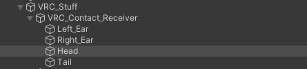
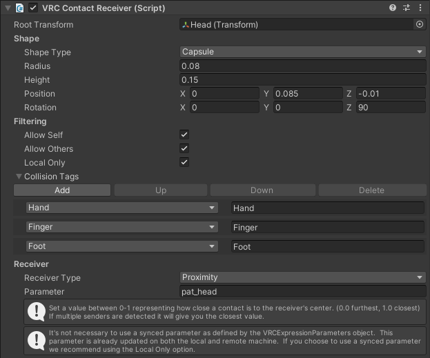
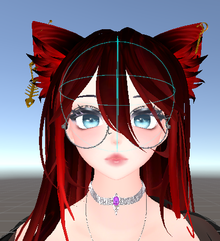
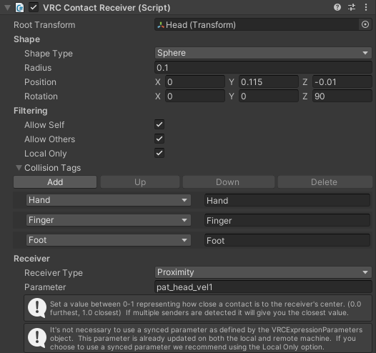
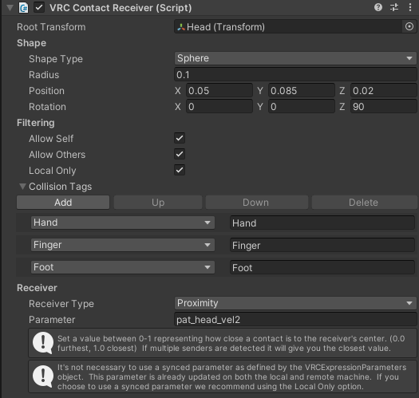
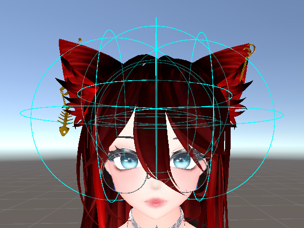
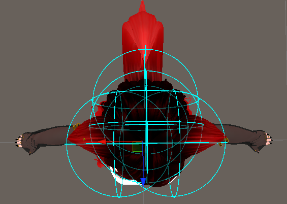

<h2 align="center">Setup Examples</h2>

<h2> 📝 Table of Contents </h2>

- [Simple Setup with one contact receiver](#simple-setup-with-one-contact-receiver)
- [Advanced Setup with multiple contact receivers](#advanced-setup-with-multiple-contact-receivers)


## Simple Setup with one contact receiver
1. Create a new Unity object. In this example "Head" <br> 
2. Add a VRC Contact Receiver (Script) to the object. <br> 
3. Setup your values as you see fit. <span style="color:red">!Important!</span> : Make sure that the "Receiver Type" is set to "Proximity" <br> 
4. Setup the "Config.ini" file. This is an example for this application: <br>
    ``` ini 
    [Defaults]

    # Source IP & port is the VRC OSC server to listen to:

    sourceIP = 127.0.0.1
    sourcePort = 9001

    # Target IP & port is the OSC server to send to:

    targetIP = ${sourceIP}
    targetPort = 9002

    # Calculated velocity will be linearly interpolated between 0 and 1 based on    these values:
    # Velocity < minVelocity, Velocity = 0
    # Velocity > maxVelocity, Velocity = 1

    minVelocity = 0.004
    maxVelocity = 0.050

    [VelocityProximityDetectors]

    # Comma separated parameter keys for each proximity value (reported from a  spherical contact receiver) that is being used to approximate velocity:

    parameterKeys = pat_head

    # The radius of each proximity contact receiver, comma separated. The number of     radii should match the number of parameter keys:

    radii = 0.08

    [HapticDevice1]

    # Target server can be set individually for each haptic device, otherwise it's  set to the default:

    targetIP = ${Defaults:targetIP}
    targetPort = ${Defaults:targetPort}

    # Each haptic device can also have its own min and max velocity set:

    minVelocity = ${Defaults:minVelocity} 
    maxVelocity = ${Defaults:maxVelocity}

    # Comma separated list of parameter keys corresponding to velocity proximity    detectors to be used to estimate contact sender velocity for this device:

    velocityProximityKeys = ${VelocityProximityDetectors:parameterKeys}

    # Proximity parameter key for how close the contact sender is to the device     (between 0 and 1)
    # Output "velocity" will be multiplied by this value:

    proximityKey = pat_head

    ```


## Advanced Setup with multiple contact receivers

In this mode, the application can use multiple contact receivers to approximate the velocity of the contact sender. 

In this mode, only one contact receiver detects a contact, the other ones are used to approximate the velocity of the contact sender.

1. Create a new Unity object. In this example "Head" <br> 
2. Add a VRC Contact Receiver (Script) to the object. <br> 
3. Setup your values as you see fit. <span style="color:red">!Important!</span> : Make sure that the "Receiver Type" is set to "Proximity" <br> 
4. Setup as many "velocity" contact receivers as you want. In this example, we have 4 contact receivers. <br>   <br>
5. The contact receivers have to be slightly offset from each other 
6. Setup the "Config.ini" file. This is an example for this application: <br>
    ``` ini
    [Defaults]

    # Source IP & port is the VRC OSC server to listen to:

    sourceIP = 127.0.0.1
    sourcePort = 9105

    # Target IP & port is the OSC server to send to:

    targetIP = ${sourceIP}
    targetPort = 9104

    # Calculated velocity will be linearly interpolated between 0 and 1 based on    these values:
    # Velocity < minVelocity, Velocity = 0
    # Velocity > maxVelocity, Velocity = 1

    minVelocity = 0.004
    maxVelocity = 0.050

    [VelocityProximityDetectors]

    # Comma separated parameter keys for each proximity value (reported from a  spherical contact receiver) that is being used to approximate velocity:

    parameterKeys = pat_head_vel1,pat_head_vel2,pat_head_vel3,pat_head_vel4

    # The radius of each proximity contact receiver, comma separated. The number of     radii should match the number of parameter keys:

    radii = 0.1,0.1,0.1,0.1

    [HapticDevice1]

    # Target server can be set individually for each haptic device, otherwise it's  set to the default:

    targetIP = ${Defaults:targetIP}
    targetPort = ${Defaults:targetPort}

    # Each haptic device can also have its own min and max velocity set:

    minVelocity = ${Defaults:minVelocity} 
    maxVelocity = ${Defaults:maxVelocity}

    # Comma separated list of parameter keys corresponding to velocity proximity    detectors to be used to estimate contact sender velocity for this device:

    velocityProximityKeys = ${VelocityProximityDetectors:parameterKeys}

    # Proximity parameter key for how close the contact sender is to the device     (between 0 and 1)
    # Output "velocity" will be multiplied by this value:

    proximityKey = pat_head

    ```